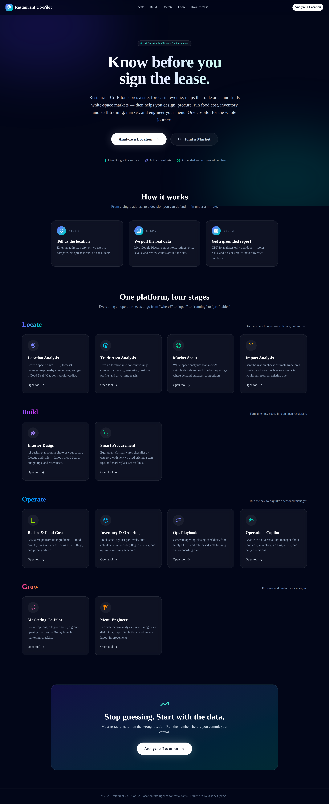
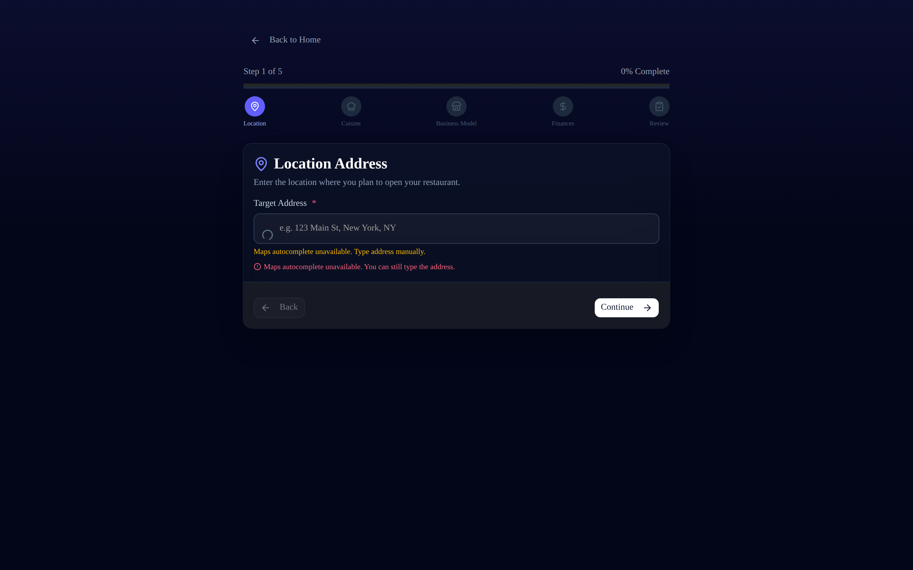
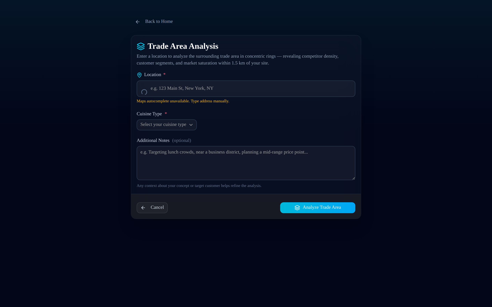
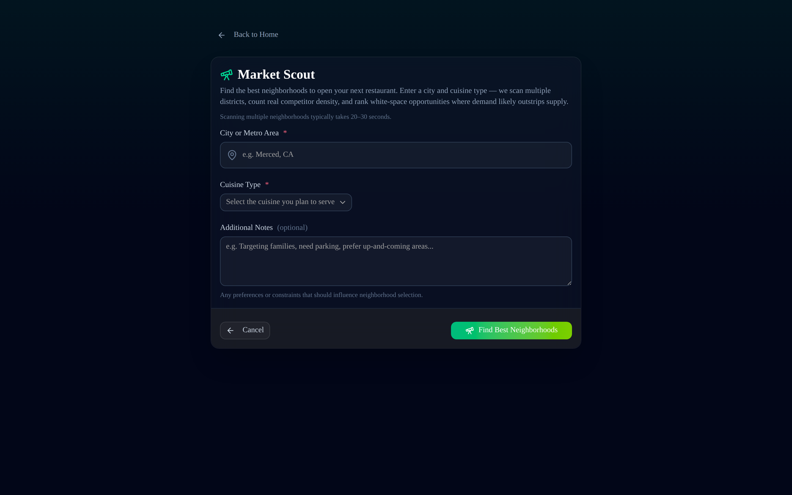
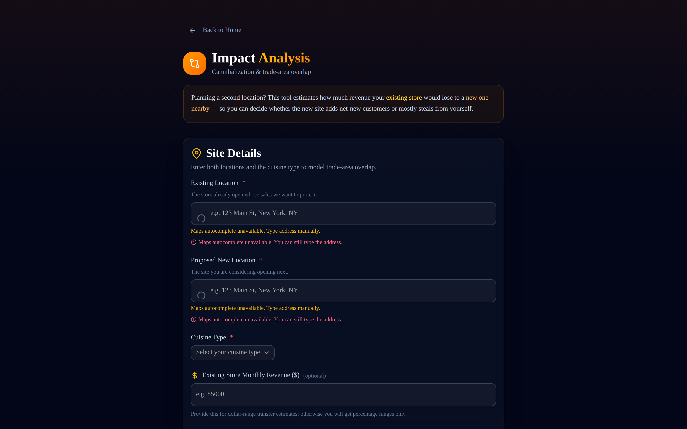
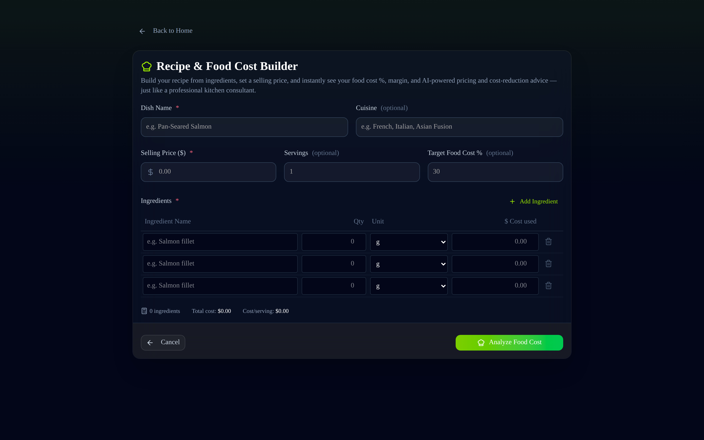
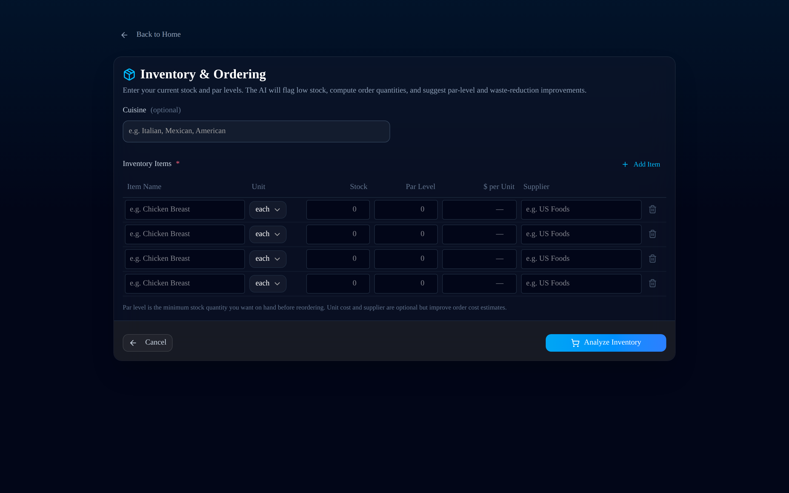
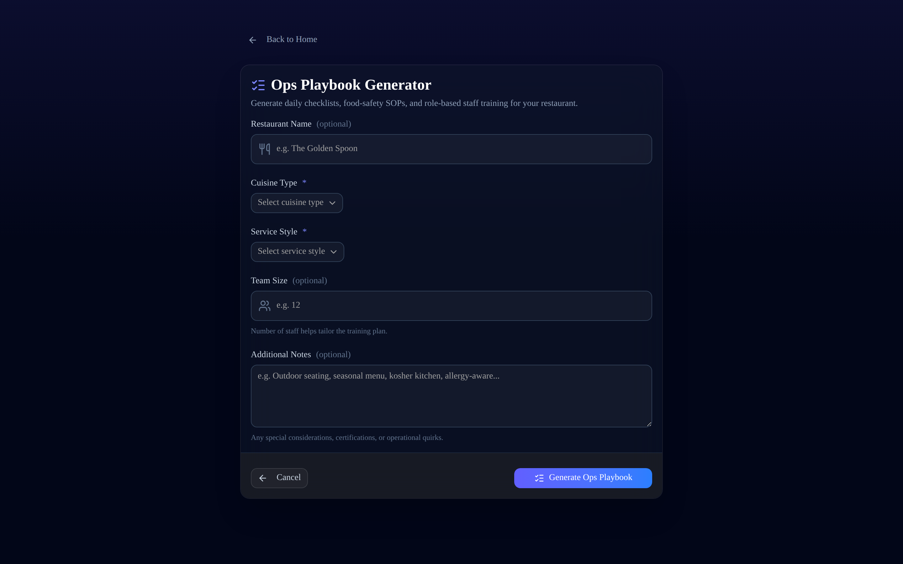
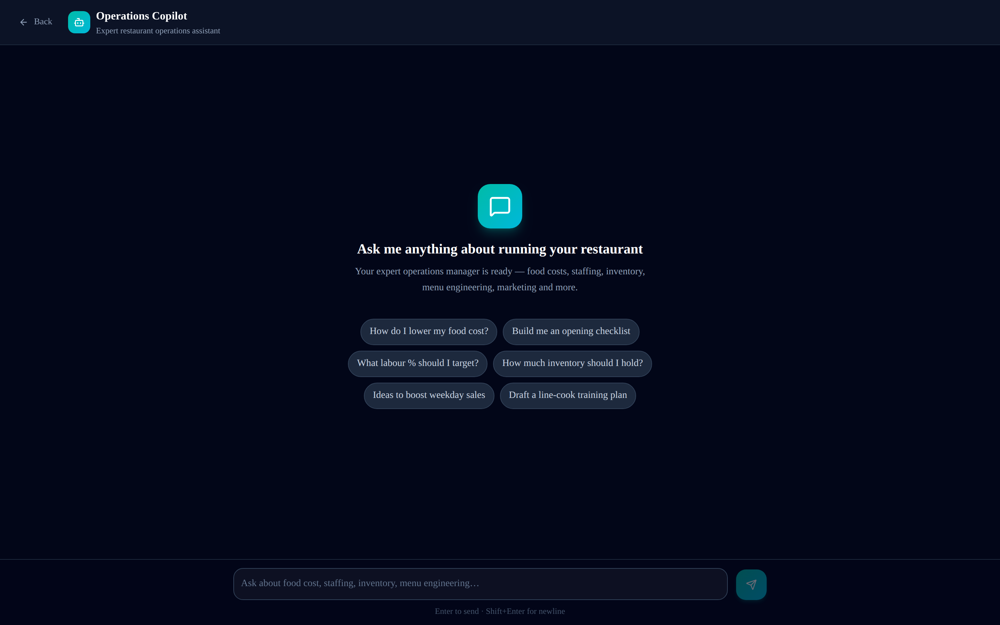
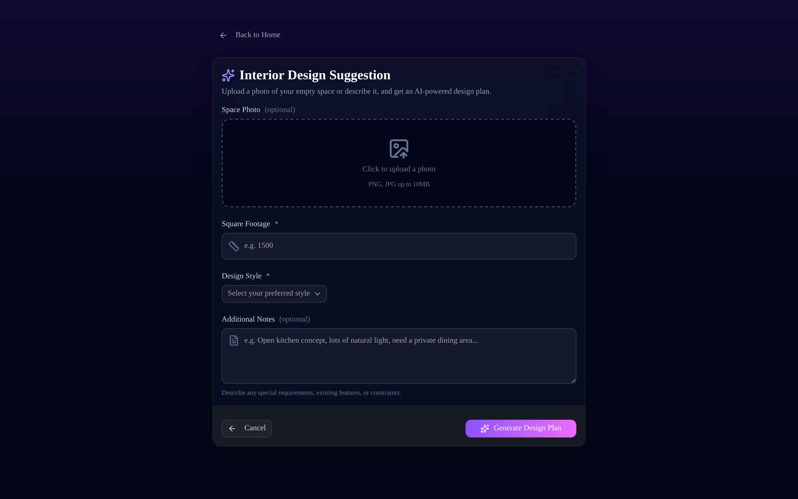

# Restaurant Co-Pilot

**Two core features:** an **AI phone agent** that answers calls and takes orders
from your menu, and **menu engineering** that turns those orders (plus any you
bulk-upload) into your most-ordered dishes, profit margins, and concrete
pricing/menu actions.

## Core features

First, **set up your menu** (`/menu-setup`) — each dish with its sell price and
food cost. Both features build on it. Orders and menu are stored in the browser
(`localStorage`) — no database required for the demo.

### 1. AI Phone Order Agent (`/phone-agent`)
A conversational GPT-4o agent answers the "call", greets the caller, only offers
dishes from your menu, confirms items and quantities, and emits a **structured
order** (items, unit prices, line totals, total). On confirmation the order is
saved automatically. The page is an in-browser **call simulator** (type, or talk
via the browser's speech recognition where available) so it works immediately —
see [Going live with real phone calls](#going-live-with-real-phone-calls-twilio)
to connect an actual phone number.

### 2. Menu Engineering from orders (`/insights`)
Phone orders flow straight in; you can also **bulk-upload** a day's or month's
orders (`Dish, qty` / `Dish xN`, one per line). The app computes — deterministically —
most-ordered dishes, revenue, and **profit margins**, renders charts, then GPT-4o
classifies each dish into the classic menu-engineering matrix (**Stars /
Plowhorses / Puzzles / Dogs**) with recommendations and pricing actions.

### Going live with real phone calls (Twilio)
The in-browser agent is fully functional today. To answer a **real** phone
number, point a [Twilio Voice](https://www.twilio.com/docs/voice) webhook at a
server route that drives the same `/api/order-agent` brain (greet →
`<Gather input="speech">` → feed the transcript to the agent → `<Say>` the
reply). Because that runs server-side, the **menu and orders must move from
`localStorage` to a database** (e.g. Postgres/Supabase) keyed by your restaurant
— that persistence layer is the main piece to add for production.

---

The app also retains a broader **restaurant-lifecycle toolkit** — from picking a
site to running it day-to-day. Decide *where* to open against **real** competitor
data (inspired by location-intelligence platforms like SiteZeus), open the doors,
then run operations like a seasoned manager (inspired by operations platforms
like Restoke.ai), and grow.

Score a site, map its trade area, scout white-space markets and check
cannibalization → design the interior and procure equipment → cost recipes,
manage inventory and ordering, generate ops checklists and staff training, and
chat with an operations copilot → market the opening and engineer the menu.
Everything is powered by GPT-4o; the location tools are grounded in structured
Google Places data, and figures that can be exact (food cost, order quantities)
are computed deterministically — so the model can't hallucinate numbers.

Built with Next.js 16 (App Router, Turbopack), React 19, Tailwind v4,
shadcn/ui, and the OpenAI + Google Maps Platform APIs.

The app is organized into a four-stage suite, surfaced on the landing page:

- **Locate** — Location Analysis, Trade Area Analysis, Market Scout, Impact Analysis
- **Build** — Interior Design, Smart Procurement
- **Operate** — Recipe & Food Cost, Inventory & Ordering, Ops Playbook, Operations Copilot
- **Grow** — Marketing Co-Pilot, Menu Engineer

The **Operate** stage is inspired by operations platforms like Restoke.ai, adapted
to run on GPT-4o with no POS/database integration required.

## Screenshots

| Landing — the four-stage suite | Location Analysis wizard |
| --- | --- |
| [](docs/screenshots/landing.png) | [](docs/screenshots/analyze.png) |

| Trade Area Analysis | Market Scout (white space) |
| --- | --- |
| [](docs/screenshots/trade-area.png) | [](docs/screenshots/market-scout.png) |

| Impact Analysis (cannibalization) | Recipe & Food Cost |
| --- | --- |
| [](docs/screenshots/impact.png) | [](docs/screenshots/recipe-cost.png) |

| Inventory & Ordering | Ops Playbook |
| --- | --- |
| [](docs/screenshots/inventory.png) | [](docs/screenshots/playbook.png) |

| Operations Copilot | Interior Design |
| --- | --- |
| [](docs/screenshots/copilot.png) | [](docs/screenshots/design.png) |

> Regenerate these with `npm run screenshots` (see
> [Generating screenshots](#generating-screenshots)).

## Features

### Locate — decide where to open

1. **Location Analysis** (`/analyze` → `/report/[id]`)
   - A 5-step required-field wizard: location (Google Places Autocomplete),
     cuisine, business model (takeover vs. lease, with model-specific fields),
     finances, and a review step.
   - The form is validated client-side at every step **and** re-validated
     server-side with Zod — no report is generated on an incomplete form.
   - The API route geocodes the address, pulls nearby restaurants via Places
     Nearby Search (1 km) enriched with Place Details (rating, price level,
     review count, types), assembles everything into a structured JSON payload,
     and only then sends it to GPT-4o. The prompt forces the model to base all
     analysis on the provided data and to say "Insufficient data" rather than
     invent figures.
   - The report includes an attractiveness score (1–10), a competitor table,
     foot-traffic and revenue estimates, top risks, negotiation advice,
     a menu-pricing sweet spot, and a final verdict.
2. **Trade Area Analysis** (`/trade-area` → `/trade-area-report/[id]`) — breaks
   a location into concentric rings (0–0.5 / 0.5–1 / 1–1.5 km) and reports
   competitor density, a saturation score, an estimated customer profile,
   drive-time reach, and opportunities/threats — all derived from live Places
   data, with estimates clearly labelled.
3. **Market Scout** (`/market-scout` → `/market-scout-report/[id]`) —
   white-space analysis: geocodes a city, proposes candidate neighborhoods,
   grounds each with real competitor counts, then ranks them by an opportunity
   score so you can see where demand likely outpaces same-cuisine competition.
4. **Impact Analysis** (`/impact` → `/impact-report/[id]`) — cannibalization
   check for a second location: measures the distance between an existing and a
   proposed site, then estimates trade-area overlap and the share of sales that
   would transfer. Clearly framed as a directional estimate (no mobile-visit
   data).

### Build — open the doors

5. **AI Design Assistant** (`/design`) — upload a photo of the space or enter
   square footage + style, and get a layout plan, mood board, budget tips, and
   reference descriptions.
6. **Smart Procurement** (`/procurement`) — equipment & smallwares checklist by
   category with new vs. used price estimates, scam-avoidance tips, and
   marketplace search links (eBay, Facebook Marketplace, WebstaurantStore).

### Operate — run the day-to-day (inspired by Restoke.ai)

7. **Recipe & Food Cost** (`/recipe-cost` → `/recipe-cost-report/[id]`) — build a
   recipe from its ingredients; the server computes total cost, cost per serving,
   food-cost %, and margin deterministically, then GPT-4o flags the expensive
   ingredients and recommends a price for a target food-cost %.
8. **Inventory & Ordering** (`/inventory` → `/inventory-report/[id]`) — enter stock
   vs. par levels; the app auto-calculates order quantities, flags low/critical
   items, totals the order cost, and GPT suggests par levels, an ordering
   schedule, and waste-reduction tips.
9. **Ops Playbook** (`/playbook` → `/playbook-report/[id]`) — generates
   opening/closing/weekly checklists, food-safety SOPs, role-based training
   modules, and a first-week onboarding plan for your cuisine and service style.
10. **Operations Copilot** (`/copilot`) — a chat with an AI restaurant manager for
    food cost, inventory, staffing, menu, and operations questions (conversation
    persists locally in the browser).

### Grow — fill seats, protect margins

11. **Marketing Co-Pilot** (`/marketing`) — social captions, a logo concept, a
    grand-opening plan, and a 30-day marketing checklist.
12. **Menu Engineer** (`/menu-engineer`) — per-dish profit-margin analysis,
    price adjustments, star dishes, unprofitable flags, and layout tips.

All AI calls run **server-side** in API routes (`src/app/api/*`) so the keys
are never exposed to the browser.

## Getting Started

1. Install dependencies:

   ```bash
   npm install
   ```

2. Configure your keys:

   ```bash
   cp .env.example .env.local
   # then edit .env.local with your real OpenAI and Google Maps keys
   ```

   See [API Keys](#api-keys) below for how to obtain each key. Then restart
   the dev server — Next.js only reads env files at startup.

3. Run the dev server:

   ```bash
   npm run dev
   ```

   Open [http://localhost:3000](http://localhost:3000).

## API Keys

This app requires **two keys**, and you must obtain them yourself — they are
tied to your own accounts and billing, so they cannot be shipped in the repo.
Both are read **server-side** (the app never exposes them to the browser) and
live in a local `.env.local` file that is gitignored.

```
OPENAI_API_KEY=sk-...your real key...
NEXT_PUBLIC_GOOGLE_MAPS_API_KEY=AIza...your real key...
```

> ⚠️ Never commit `.env.local`. It is already in `.gitignore` so your keys stay
> private.

### Google Maps API key

Required by the **Locate** tools — Location Analysis, Trade Area Analysis,
Market Scout, and Impact Analysis — for Geocoding, Places Nearby Search, Place
Details, and the address Autocomplete widget. Without it you'll see *"Google
Maps API key is not configured"*. (The Build, Operate, and Grow tools are
GPT-only and don't need this key.)

1. Go to the [Google Cloud Console](https://console.cloud.google.com/) and
   sign in.
2. Create a project (or select an existing one).
3. **Enable billing** on the project. Google provides a large free monthly
   credit and this app's usage is tiny, but a payment method is required to
   activate the Maps APIs.
4. Open **APIs & Services → Library** and enable all three:
   - **Geocoding API**
   - **Places API**
   - **Maps JavaScript API**
5. Open **APIs & Services → Credentials → Create Credentials → API key** and
   copy the key into `NEXT_PUBLIC_GOOGLE_MAPS_API_KEY`.
6. (Recommended) Restrict the key to your domain / localhost and to the three
   APIs above so it can't be misused.

### OpenAI API key

Powers every AI feature across all four stages (Locate, Build, Operate, Grow) —
including the Operations Copilot chat. Without it, report generation fails with
*"OpenAI API key is not configured"*.

1. Go to [platform.openai.com/api-keys](https://platform.openai.com/api-keys)
   and sign in.
2. Click **Create new secret key** and copy it (it is shown only once) into
   `OPENAI_API_KEY`.
3. Make sure the account has billing credit — the reports use the GPT-4o model.

### After adding keys

Restart the dev server (`Ctrl+C`, then `npm run dev` again). Env files are only
read at startup, so changes won't take effect until you restart.

## Scripts

- `npm run dev` — start the dev server
- `npm run build` — production build
- `npm run start` — serve the production build
- `npm run lint` — run ESLint
- `npm run screenshots` — regenerate the README screenshots (see below)

## Project Structure

```
RestoMind/
├── src/
│   ├── app/
│   │   ├── page.tsx                 # Landing page — the Locate/Build/Operate/Grow suite
│   │   ├── layout.tsx               # Root layout + metadata
│   │   ├── globals.css              # Tailwind v4 theme tokens
│   │   │
│   │   ├── analyze/                 # Locate · Location Analysis (5-step wizard)
│   │   ├── report/[id]/             #   └─ its report
│   │   ├── trade-area/              # Locate · Trade Area Analysis
│   │   ├── trade-area-report/[id]/
│   │   ├── market-scout/            # Locate · Market Scout (white space)
│   │   ├── market-scout-report/[id]/
│   │   ├── impact/                  # Locate · Impact Analysis (cannibalization)
│   │   ├── impact-report/[id]/
│   │   │
│   │   ├── design/                  # Build · Interior Design
│   │   ├── design-report/[id]/
│   │   ├── procurement/             # Build · Smart Procurement
│   │   ├── procurement-report/[id]/
│   │   │
│   │   ├── recipe-cost/             # Operate · Recipe & Food Cost
│   │   ├── recipe-cost-report/[id]/
│   │   ├── inventory/               # Operate · Inventory & Ordering
│   │   ├── inventory-report/[id]/
│   │   ├── playbook/                # Operate · Ops Playbook
│   │   ├── playbook-report/[id]/
│   │   ├── copilot/                 # Operate · Operations Copilot (chat)
│   │   │
│   │   ├── marketing/               # Grow · Marketing Co-Pilot
│   │   ├── marketing-report/[id]/
│   │   ├── menu-engineer/           # Grow · Menu Engineer
│   │   ├── menu-engineer-report/[id]/
│   │   │
│   │   └── api/                     # Server-side routes (one per feature) — keys never reach the browser
│   │       ├── analyze/  trade-area/  market-scout/  impact/
│   │       ├── design/  procurement/
│   │       ├── recipe-cost/  inventory/  playbook/  copilot/
│   │       └── marketing/  menu-engineer/
│   │
│   ├── components/
│   │   ├── places-autocomplete.tsx  # Google Places Autocomplete input
│   │   └── ui/                      # shadcn/ui primitives (button, card, select, tabs, …)
│   │
│   └── lib/
│       ├── places.ts                # Shared Google Places + OpenAI helpers (geocode, nearby, keys)
│       ├── schemas.ts               # Zod validation schemas
│       └── utils.ts                 # cn() class helper
│
├── scripts/
│   └── screenshots.mjs              # Playwright script that generates docs/screenshots/*.png
├── docs/screenshots/               # README images
├── public/                          # Static assets
├── .env.example                     # Template for the two required API keys
└── package.json
```

Each feature follows the same shape: an **input page** (`/feature`) → a
**server API route** (`/api/feature`) that calls GPT-4o (and Google Places for
the Locate tools) → a **report page** (`/feature-report/[id]`) that reads the
result from `localStorage`. The Operations Copilot is the one exception — it's a
chat UI with no separate report page.

## Generating screenshots

The images in [Screenshots](#screenshots) are produced by a Playwright script
against the running app. Playwright is **not** a project dependency, so install
it on demand:

```bash
npm install --save-dev playwright   # one-time
npx playwright install chromium     # downloads the browser

npm run build
PORT=3100 npm run start              # serve the app in one terminal

npm run screenshots                  # in another terminal → writes docs/screenshots/*.png
```

The script captures the landing page and the main tool screens (no API keys
required for those — the forms render without them).
